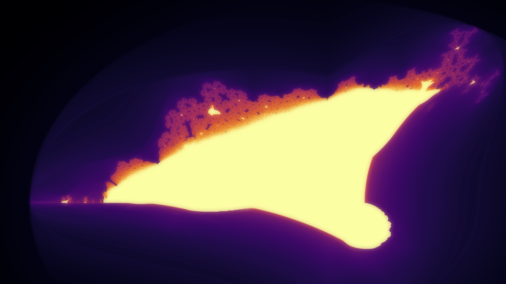
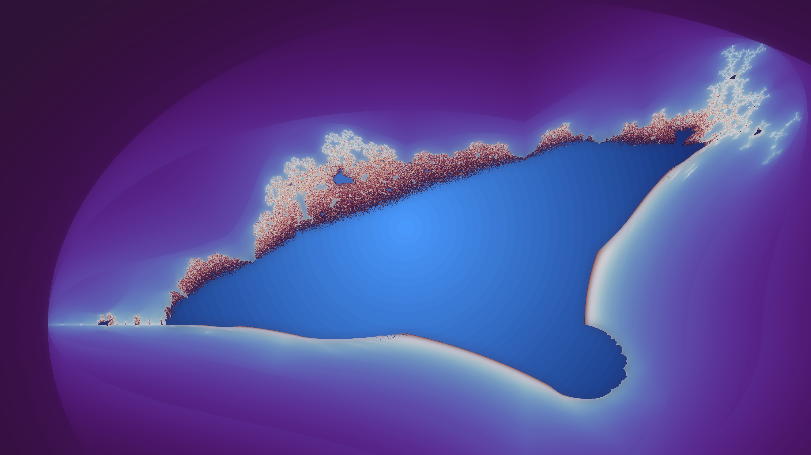
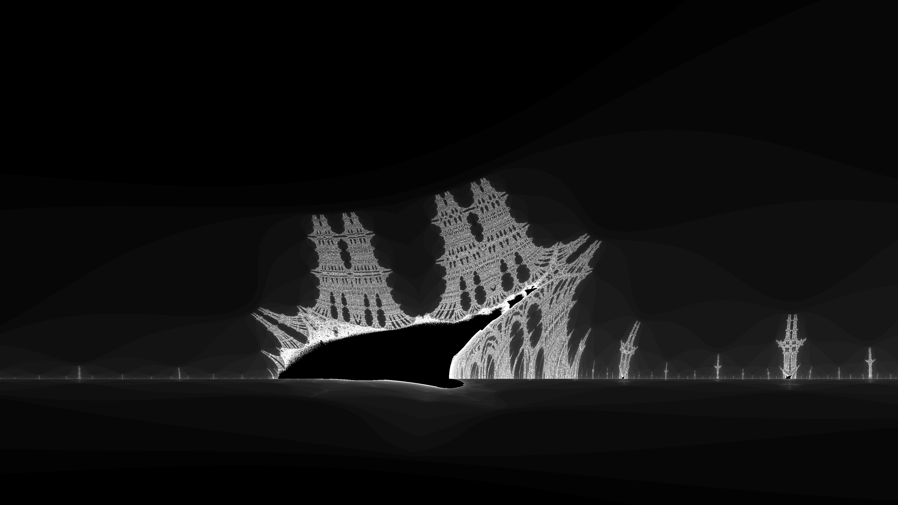
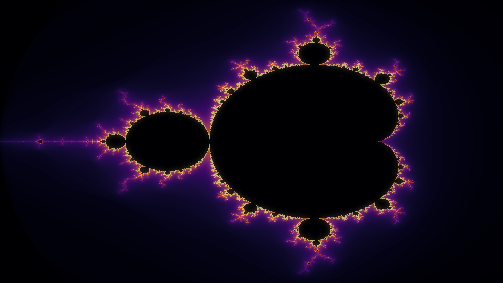
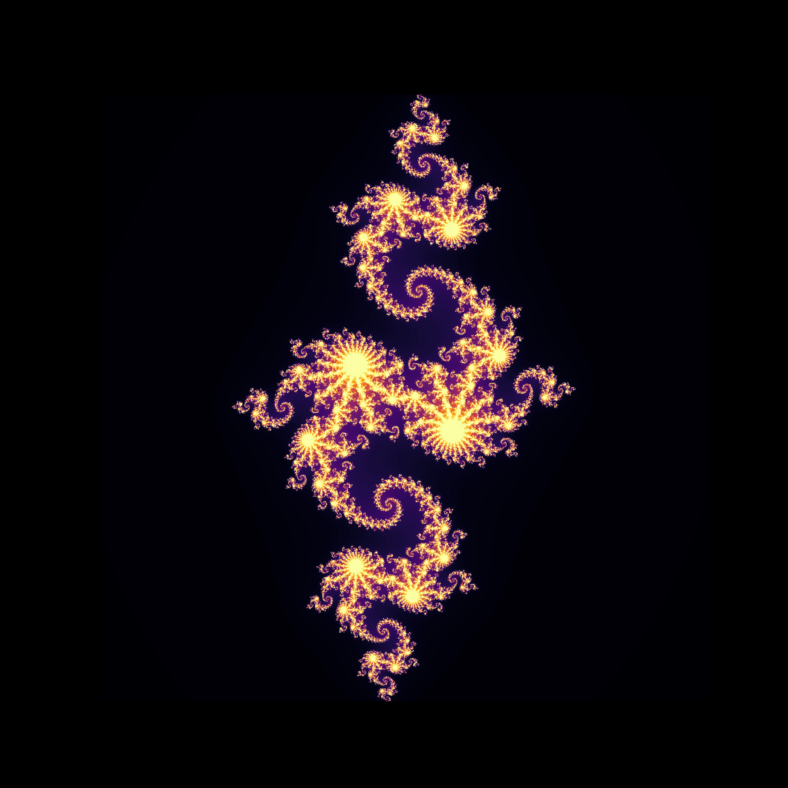
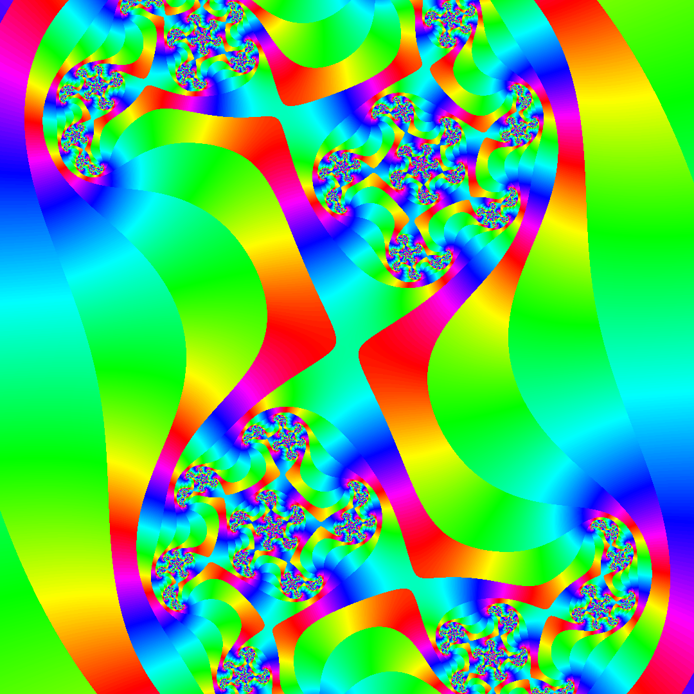

# Fractal Weekends

Each weekend, I share a new type of fractal: generator, style, animation, and all the code needed to reproduce it.

---

## 🔷 Current Fractal: Burning Ship

All the following visuals are located in the [`buring_ship/`](./buring_ship) directory.

| Preview | Title |
|--------|-------|
|  | **burning_ship_4k.png** — Standard high-resolution rendering |
|  | **burning_ship_4k_ultra.png** — Ultra-detailed version |
|  | **burning_ship_bateau_centre_4k.png** — Centered ship visual |
|  | **burning_ship_inferno.png** — With inferno colormap |

---

## 🌀 Other Fractals

| Preview | Title |
|--------|-------|
|  | **mandelbrot_distance_4k.png** — Mandelbrot with distance est. |
|  | **julia_pm25_2016_domain.gif** — Animated Julia with PM2.5 |
|  | **julia_a.png** — Julia visual variation |
|  | **julia.jp2** — Static Julia domain coloring |

---

## Features

- Python-based fractal generation
- High-res outputs (4K+)
- Domain coloring, super-sampling, distance estimation
- Parallel rendering (`multiprocessing`)
- Artistic styles: noise, glow, sparkles, gradients

---

## Structure

```bash
fractals/
│
├── buring_ship/
│   ├── script_burning_ship.py
│   ├── burning_ship_4k.png
│   ├── ...
│   └── README.md
├── README.md
